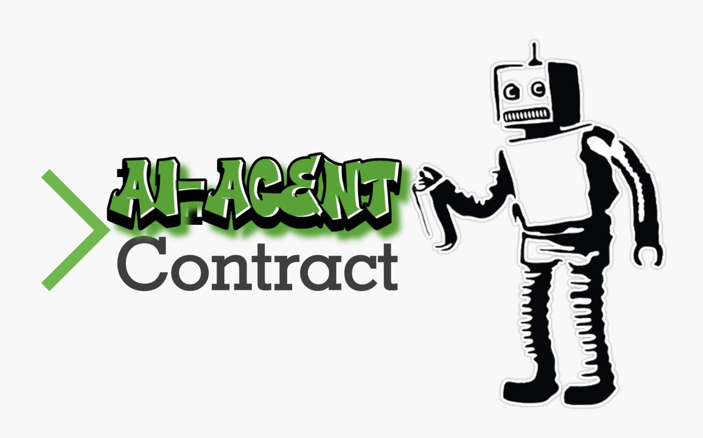

<div align="center">
  <a href="https://github.com/Phala-Network/ai-agent-template-func-calling">
    <h1>AI Agent Contract Template with OpenAI Function Calling</h1>
    
    <br />
  </a>
  <a href="https://platform.openai.com/docs/api-reference">
    
    <br />
  </a>
  <p align="center">
    Host your AI Agent Contract on Phala's decentralized serverless cloud.
    <br />
    <a href="https://github.com/Phala-Network/ai-agent-template-func-calling"><strong>Explore the docs »</strong></a>
    <br />
    <br />
    <a href="https://wapo-testnet.phala.network/ipfs/QmQZYAkEz8RnX9phpWscDLsv1u7uBATaAYHb1prpFGvD4n?key=5150856fe20eb558&chatQuery=What%20are%20activities%20to%20do%20in%20Singapore%20today">View Demo</a>
    ·
    <a href="https://github.com/Phala-Network/ai-agent-template-func-calling/issues">Report Bug</a>
    ·
    <a href="https://discord.gg/DXGGJajW">Discord</a>
  </p>

<h3>Architecure Overview</h3>

</div>

## 🤖 What Is This?!

<div align="center">
  
</div>

The OpenAI AI Agent template is a **MINIMAL** template to build an AI Agent that can be hosted on Phala Network's decentralized hosting protocol. Unlike Vercel or other FaaS, it allows you to publish your AI Agent compiled code to IPFS and hosts it on a fully decentralized FaaS cloud with the following benefits:

- 💨 Ship Fast: Build and ship with familiar toolchain in minutes
- ⛑️ Secure: Execution guarded by rock solid TEE / Intel SGX
- 🔒 Private: Host API keys and user privacy at ease
- 💎 Unstoppable: Powered by IPFS and Phala's 35k+ decentralized TEE workers

[//]: # ()

## Getting Started
### Prepare
Install dependencies
```shell
npm install
```

### Testing Locally
Create `.env` file with the default ThirdWeb API key for publishing your Agent Contract to IPFS
```shell
cp .env.example .env
```

Build your Agent
```shell
npm run build
```

Test your Agent locally. Get an OpenAI API key from [OpenAI](https://platform.openai.com/account/api-keys) and set the API Key in your [test.ts](./tests/test.ts) file
```shell
npm run test
```

Expected Test Results
```shell
INPUT: {"method":"GET","path":"/ipfs/CID","queries":{},"secret":{"openaiApiKey":"OPENAI_API_KEY"},"headers":{}}
[0]chat
[1]chat
[2]chat
GET RESULT: {
  status: 200,
  body: `{"message":"There's a lot to do in Austin, Texas! Here are some activities you might consider based on the current weather and various interests:\\n\\n### Outdoor Activities\\n1. **Lady Bird Lake & Zilker Park**\\n   - **Kayaking/Paddleboarding**: Enjoy a relaxing paddle on Lady Bird Lake.\\n   - **Hiking/Biking**: Explore the trails around Zilker Park and Barton Springs.\\n\\n2. **Barton Springs Pool**\\n   - A perfect spot for a swim and to cool off from the summer heat.\\n\\n3. **Mount Bonnell**\\n   - For those who love scenic views and a bit of hiking, head to Mount Bonnell for a panoramic view of the city.\\n\\n### Cultural Activities\\n1. **Blanton Museum of Art**\\n   - Explore a variety of art collections ranging from contemporary to ancient.\\n\\n2. **Bullock Texas State History Museum**\\n   - Learn about the rich history of Texas through exhibits and films.\\n\\n3. **South Congress Avenue (SoCo)**\\n   - Wander through boutique shops, galleries, and enjoy some street performances.\\n\\n### Music & Nightlife\\n1. **Live Music**\\n   - Check out iconic venues like the Continental Club or Antone’s for some live performances.\\n\\n2. **Rainey Street Historic District**\\n   - Explore a variety of bars and food trucks in this lively area.\\n\\n### Food & Beverage\\n1. **BBQ Heaven**\\n   - Visit Franklin Barbecue or la Barbecue for some of the best BBQ in the city.\\n   \\n2. **Food Trucks**\\n   - Explore the diverse array of food trucks offering a variety of cuisines.\\n\\n### Weather Considerations\\n- The apparent temperature during the day can reach up to 37.2°C (98.96°F) with some moments going as high as 38.9°C (102.02°F). Ensure you stay hydrated and take breaks in shaded or air-conditioned areas.\\n\\nNo matter what your interests are, Austin has a variety of activities to make your day enjoyable. Make sure to check local event listings as well for any special events or festivals happening today."}`,
  headers: {
    'Content-Type': 'application/json',
    'Access-Control-Allow-Origin': '*'
  }
}
INPUT: {"method":"GET","path":"/ipfs/CID","queries":{"chatQuery":["What are some activities based in Brussels today?"]},"secret":{"openaiApiKey":"OPENAI_API_KEY"},"headers":{}}
[0]chat
[1]chat
[2]chat
[3]chat
GET RESULT: {
  status: 200,
  body: `{"message":"Brussels is a vibrant city with a lot of things to offer on any given day. Here are some activities you can enjoy today:\\n\\n### Outdoor Activities\\n1. **Grand Place**\\n   - Visit the heart of Brussels and marvel at the stunning architecture. You might catch some street performances as well.\\n\\n2. **Parc du Cinquantenaire**\\n   - Take a relaxing stroll or have a picnic in this beautiful park.\\n\\n3. **Atomium**\\n   - Explore this unique building and enjoy panoramic views of the city.\\n\\n### Cultural Activities\\n1. **Royal Museums of Fine Arts of Belgium**\\n   - Explore Belgian art and various exhibitions ranging from ancient to modern art.\\n\\n2. **Magritte Museum**\\n   - Dive into the surreal world of René Magritte, one of Belgium's most famous artists.\\n\\n3. **Belgian Comic Strip Center**\\n   - Discover the rich history of comic strips in Belgium, including famous characters like Tintin.\\n\\n### Gourmet Experiences\\n1. **Chocolate and Beer Tours**\\n   - Take a guided tour to sample some of Brussels' best chocolates and beers.\\n\\n2. **Waffles and Frites**\\n   - Enjoy traditional Belgian waffles and fries at local eateries.\\n\\n### Shopping and Markets\\n1. **Galeries Royales Saint-Hubert**\\n   - Explore this beautiful shopping arcade filled with boutique shops and cafes.\\n\\n2. **Marolles Flea Market**\\n   - Hunt for unique items and antiques at this bustling market.\\n\\n### Theatre and Music\\n1. **Ancienne Belgique**\\n   - Check out the schedule for any concerts or performances happening today.\\n\\n2. **La Monnaie/De Munt**\\n   - Attend an opera or a ballet performance if available.\\n\\n### Historical Sites\\n1. **Manneken Pis**\\n   - Visit this famous statue, which often gets dressed up in various costumes.\\n\\n2. **Palais de Justice**\\n   - Visit this impressive courthouse and enjoy the views from its location.\\n\\n### Weather Considerations\\n- The apparent temperature in Brussels today ranges from 15.9°C (60.62°F) in the early morning to a high of around 31.6°C (88.88°F) in the late afternoon. Thus, it is quite pleasant for outdoor activities.\\n\\nWhatever your interests, Brussels has something to offer for everyone. Make sure to check local event listings as well for any special events or festivals happening today. Enjoy your day!"}`,
  headers: {
    'Content-Type': 'application/json',
    'Access-Control-Allow-Origin': '*'
  }
}
Now you are ready to publish your agent, add secrets, and interact with your agent in the following steps:
- Execute: 'npm run publish-agent'
- Set secrets: 'npm run set-secrets'
- Go to the url produced by setting the secrets (e.g. https://wapo-testnet.phala.network/ipfs/QmPQJD5zv3cYDRM25uGAVjLvXGNyQf9Vonz7rqkQB52Jae?key=b092532592cbd0cf)
```

### Publish Your AI Agent
Upload your compiled AI Agent code to IPFS.
```shell
npm run publish-agent
```

Upon a successful upload, the command should show the URL to access your AI Agent.
```shell
✓ Compiled successfully.
  78.19 KB  dist/index.js
Running command: npx thirdweb upload dist/index.js
This may require you to log into thirdweb and will take some time to publish to IPFS...

    $$\     $$\       $$\                 $$\                         $$\       
    $$ |    $$ |      \__|                $$ |                        $$ |      
  $$$$$$\   $$$$$$$\  $$\  $$$$$$\   $$$$$$$ |$$\  $$\  $$\  $$$$$$\  $$$$$$$\  
  \_$$  _|  $$  __$$\ $$ |$$  __$$\ $$  __$$ |$$ | $$ | $$ |$$  __$$\ $$  __$$\ 
    $$ |    $$ |  $$ |$$ |$$ |  \__|$$ /  $$ |$$ | $$ | $$ |$$$$$$$$ |$$ |  $$ |
    $$ |$$\ $$ |  $$ |$$ |$$ |      $$ |  $$ |$$ | $$ | $$ |$$   ____|$$ |  $$ |
    \$$$$  |$$ |  $$ |$$ |$$ |      \$$$$$$$ |\$$$$$\$$$$  |\$$$$$$$\ $$$$$$$  |
     \____/ \__|  \__|\__|\__|       \_______| \_____\____/  \_______|\_______/ 

 💎 thirdweb v0.14.12 💎

- Uploading file to IPFS. This may take a while depending on file sizes.

✔ Successfully uploaded file to IPFS.
✔ Files stored at the following IPFS URI: ipfs://QmQZYAkEz8RnX9phpWscDLsv1u7uBATaAYHb1prpFGvD4n
✔ Open this link to view your upload: https://b805a9b72767504353244e0422c2b5f9.ipfscdn.io/ipfs/bafybeibbasdv4xt32ea74ga77rpr5kgnkxcgqbtoslgxagzhmmujcjwkym/

Agent Contract deployed at: https://wapo-testnet.phala.network/ipfs/QmQZYAkEz8RnX9phpWscDLsv1u7uBATaAYHb1prpFGvD4n

If your agent requires secrets, ensure to do the following:
1) Edit the ./secrets/default.json file or create a new JSON file in the ./secrets folder and add your secrets to it.
2) Run command: 'npm run set-secrets' or 'npm run set-secrets [path-to-json-file]'
Logs folder created.
Deployment information updated in ./logs/latestDeployment.json
```

> :information_source: Note that your latest deployment information will be logged to in file [`./logs/latestDeployment.json`](./logs/latestDeployment.json). This file is updated every time you publish a new Agent Contract to IPFS. This file is also used to get the IPFS CID of your Agent Contract when setting secrets for your Agent Contract.
>
> Here is an example:
> ```json
> {
>   "date": "2024-08-29T20:28:20.081Z",
>   "cid": "QmYzBTdQNPewdhD9GdBJ9TdV7LVhrh9YVRiV8aBup7qZGu",
>   "url": "https://wapo-testnet.phala.network/ipfs/QmYzBTdQNPewdhD9GdBJ9TdV7LVhrh9YVRiV8aBup7qZGu"
> }
> ```

<details>
<summary>New to Thirdweb?</summary>
We use <a href="https://thirdweb.com/dashboard/infrastructure/storage">thirdweb Storage</a> to host IPFS contents. If you are new to thirdweb, the command will guide you to create your account or login to your existing account from the browser.
</details>

> **Did Thirdweb fail to publish?**
>
> If ThirdWeb fails to publish, please signup for your own ThirdWeb account to publish your Agent Contract to IPFS. Signup or login at https://thirdweb.com/dashboard/
>
> Whenever you log into ThirdWeb, create a new API key and replace the default API Key with yours in the [.env](./.env) file.
>
> ```
> THIRDWEB_API_KEY="YOUR_THIRDWEB_API_KEY"
> ```

### Access the Published AI Agent

Once published, your AI Agent is available at the URL: `https://wapo-testnet.phala.network/ipfs/<your-cid>`. You can get it from the "Publish to IPFS" step.

You can test it with `curl`.

```bash
curl https://wapo-testnet.phala.network/ipfs/<your-cid>
```

### Add Secrets

By default, all the compiled JS code is visible for anyone to view if they look at IPFS CID. This makes private info like API keys, signer keys, etc. vulnerable to be stolen. To protect devs from leaking keys, we have added a field called `secret` in the `Request` object. It allows you to store secrets in a vault for your AI Agent to access.

To add your secrets,
1) Edit the [default.json](./secrets/default.json) file or create a new JSON file in the `./secrets` folder and add your secrets to it.
```json
{
  "openaiApiKey": "YOUR_OPENAI_API_KEY"
}
```
2) Run command to set the secrets
```shell
npm run set-secrets
# or if you have a custom JSON file
npm run set-secrets <path-to-json-file>
```
Expected output:
```shell
Use default secrets...
Storing secrets...
  % Total    % Received % Xferd  Average Speed   Time    Time     Time  Current
                                 Dload  Upload   Total   Spent    Left  Speed
100   205    0    68  100   137    105    213 --:--:-- --:--:-- --:--:--   319
{"token":"37a0f3f344a3bbf7","key":"343e2a7dc130fedf","succeed":true}

Secrets set successfully. Go to the URL below to interact with your agent:
https://wapo-testnet.phala.network/ipfs/QmYzBTdQNPewdhD9GdBJ9TdV7LVhrh9YVRiV8aBup7qZGu?key=343e2a7dc130fedf
Log entry added to secrets.log
```

> :information_source: Note that all your secrets will be logged in file [`./logs/secrets.log`](./logs/secrets.log). This file is updated every time you add new secrets to your Agent Contract. If you have not published an Agent Contract, yet, this command will fail since there is not a CID to map the secrets to.
>
> Here is an example:
> ```text
> 2024-08-29T20:30:35.480Z, CID: [QmYzBTdQNPewdhD9GdBJ9TdV7LVhrh9YVRiV8aBup7qZGu], Token: [37a0f3f344a3bbf7], Key: [343e2a7dc130fedf], URL: [https://wapo-testnet.phala.network/ipfs/QmYzBTdQNPewdhD9GdBJ9TdV7LVhrh9YVRiV8aBup7qZGu?key=343e2a7dc130fedf]
> ```

The API returns a `token` and a `key`. The `key` is the id of your secret. It can be used to specify which secret you are going to pass to your frame. The `token` can be used by the developer to access the raw secret. You should never leak the `token`.

To verify the secret, run the following command where `key` and `token` are replaced with the values from adding your `secret` to the vault.
```shell
curl https://wapo-testnet.phala.network/vaults/<key>/<token>
```

Expected output:
```shell
{"data":{"openaiApiKey":"<OPENAI_API_KEY>"},"succeed":true}
```

### Access Queries
To help create custom logic, we have an array variable named `queries` that can be accessed in the `Request` class. To access the `queries` array variable `chatQuery` value at index `0`, the syntax will look as follows:
```typescript
const query = req.queries.chatQuery[0] as string;
```
The example at https://wapo-testnet.phala.network/ipfs/QmQZYAkEz8RnX9phpWscDLsv1u7uBATaAYHb1prpFGvD4n?key=5150856fe20eb558&chatQuery=What%20are%20activities%20to%20do%20in%20Singapore%20today will have a value of `When did humans land on the moon`. `queries` can have any field name, so `chatQuery` is just an example of a field name and not a mandatory name, but remember to update your `index.ts` file logic to use your expected field name.

### Debugging

To debug your agent, you can use the following command:
```shell
curl https://wapo-testnet.phala.network/logs/all/ipfs/<CID>
```

After executing this command then you should see some output in the terminal to show the logs of requests to your agent.
```shell
2024-09-04T03:18:34.758Z [95f5ec53-3d71-4bb5-bbb6-66065211102c] [REPORT] END Request: Duration: 166ms
2024-09-04T03:18:34.758Z [95f5ec53-3d71-4bb5-bbb6-66065211102c] [INFO] 'Is signature valid? ' true
2024-09-04T03:18:34.758Z [95f5ec53-3d71-4bb5-bbb6-66065211102c] [INFO] 'Verifying Signature with PublicKey ' '0xC1BF8dB4D06416c43Aca3deB289CF7CC0aAFF540'
2024-09-04T03:18:34.758Z [95f5ec53-3d71-4bb5-bbb6-66065211102c] [REPORT] START Request: GET /ipfs/QmfLpQjxAMsppUX9og7xpmfSKZAZ8zuWJV5g42DmpASSWz?key=0e26a64a1e805bfd&type=verify&data=tintinland%20message%20to%20sign&signature=0x34c4d8c83406e7a292ecc940d60b34c9b11024db10a8872c753b9711cd6dbc8f746da8be9bc2ae0898ebf8f49f48c2ff4ba2a851143c3e4b371647eed32f707b1b
2024-09-04T03:17:15.238Z [768b6fda-f9f1-463f-86bd-a948e002bf80] [REPORT] END Request: Duration: 183ms
2024-09-04T03:17:15.238Z [768b6fda-f9f1-463f-86bd-a948e002bf80] [INFO] 'Signature: 0x34c4d8c83406e7a292ecc940d60b34c9b11024db10a8872c753b9711cd6dbc8f746da8be9bc2ae0898ebf8f49f48c2ff4ba2a851143c3e4b371647eed32f707b1b'
2024-09-04T03:17:15.238Z [768b6fda-f9f1-463f-86bd-a948e002bf80] [INFO] 'Signing data [tintinland message to sign] with Account [0xC1BF8dB4D06416c43Aca3deB289CF7CC0aAFF540]'
2024-09-04T03:17:15.238Z [768b6fda-f9f1-463f-86bd-a948e002bf80] [REPORT] START Request: GET /ipfs/QmfLpQjxAMsppUX9og7xpmfSKZAZ8zuWJV5g42DmpASSWz?key=0e26a64a1e805bfd&type=sign&data=tintinland%20message%20to%20sign
2024-09-04T03:16:38.507Z [3717d307-bff0-4fc0-bc98-8f66c33dd46f] [REPORT] END Request: Duration: 169ms
2024-09-04T03:16:38.507Z [3717d307-bff0-4fc0-bc98-8f66c33dd46f] [REPORT] START Request: GET /ipfs/QmfLpQjxAMsppUX9og7xpmfSKZAZ8zuWJV5g42DmpASSWz?key=0e26a64a1e805bfd
2024-09-04T03:15:00.375Z [793f58f9-f24f-4580-8ebc-04debb7d727f] [REPORT] END Request: Duration: 158ms
2024-09-04T03:15:00.375Z [793f58f9-f24f-4580-8ebc-04debb7d727f] [REPORT] START Request: GET /ipfs/QmfLpQjxAMsppUX9og7xpmfSKZAZ8zuWJV5g42DmpASSWz?key=0e26a64
a1e805bfd
```
To create logs in your Agent Contract, you can use the following syntax in your `index.ts` file.
```typescript
// info logs
console.log('info log message!')
// error logs
console.error('error log message!')
```
For more information check the [MDN docs](https://developer.mozilla.org/en-US/docs/Web/API/console) on `console` object.

## FAQ

<details>
<summary><b>What packages can I use in the AI Agent server?</b></summary>
<ul>
  <li>Most of the npm packages are supported: viem, onchainkit, ….</li>
  <li>Some packages with some advanced features are not supported:</li>
  <ul>
    <li>Memory usage over 100MB</li>
    <li>Web Assembly</li>
    <li>Browser only features: local storage, service workers, etc</li>
  </ul>
</ul>
</details>

<details>
<summary><b>What’s the spec of the Javascript runtime?</b></summary>
<ul>
  <li>The code runs inside a tailored <a href="https://bellard.org/quickjs/">QuickJS engine</a></li>
  <li>Available features: ES2023, async, fetch, setTimeout, setInterval, bigint</li>
  <li> <a href="https://docs.phala.network/tech-specs/ai-agent-contract#wapojs/">Tech spec doc</a></li>
</ul>
</details>

<details>
<summary><b>Why is the serverless platform secure?</b></summary>
<ul>
  <li>Your AI Agent code on is fully secure, private, and permissionless. Nobody can manipulate your program, steal any data from it, or censor it.</li>
  <li>Security: The code is executed in the decentralized TEE network running on Phala Network. It runs code inside a secure blackbox (called enclave) created by the CPU. It generates cryptographic proofs verifiable on Phala blockchain. It proves that the hosted code is exactly the one you deployed.</li>
  <li>Privacy: You can safely put secrets like API keys or user privacy on Phala Network. The code runs inside TEE hardware blackboxs. The memory of the program is fully encrypted by the TEE. It blocks any unauthorized access to your data.</li>
  <li>Learn more at <a href="https://phala.network">Phala Network Homepage</a></li>
</details>

<details>
<summary><b>What's TEE / Intel SGX?</b></summary>
<ul>
  <li><a href="https://collective.flashbots.net/t/tee-sgx-wiki/2019">TEE/SGX wiki</a></li>
  <li><a href="https://collective.flashbots.net/t/debunking-tee-fud-a-brief-defense-of-the-use-of-tees-in-crypto/2931">Debunking TEE FUD: A Brief Defense of The Use of TEEs in Crypto</a></li>
</details>
